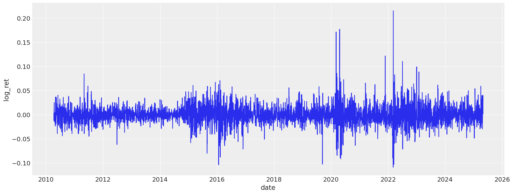
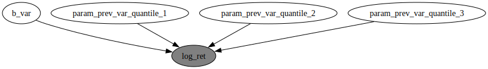
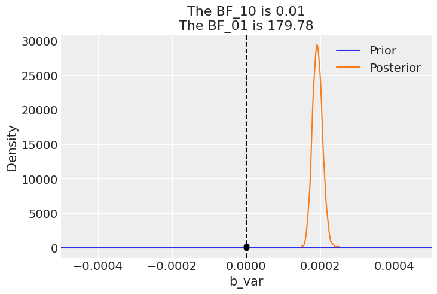
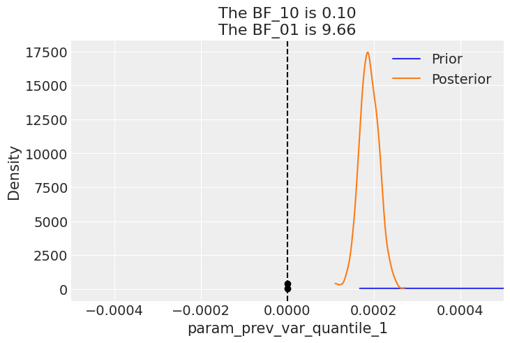
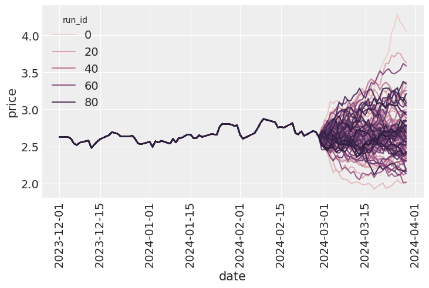
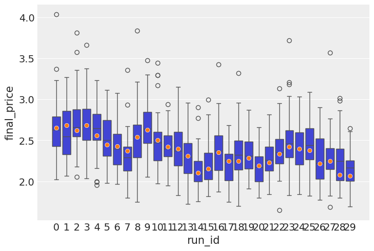

# A Bayesian GARCH-Inspired Volatility Model for Energy Commodities
Option Pricing


<!-- WARNING: THIS FILE WAS AUTOGENERATED! DO NOT EDIT! -->

## TLDR

I built a Bayesian GARCH-like model for heating oil prices using
NumPyro. Here’s the full messy journey. Also, as if it was not clear,
never ever attempt to use it for anything practical - this will not end
well, so not a financial advice :D

## Introduction

I’ve been interested in financial markets for a while, especially the
modeling failures surrounding the 2008 financial crisis. One recurring
theme is how standard models struggled to capture risk during volatile
periods. That led me to explore financial modeling more seriously,
starting with option pricing as a fundamental use case.

While it’s easy enough to plug numbers into Black-Scholes, I wanted to
build something from the ground up—specifically a model that learns
volatility structure directly from data. So I built a GARCH-inspired,
fully Bayesian model using NumPyro that captures both return and
variance dynamics.

This post walks through that process: loading and transforming market
data, fitting the model, simulating future prices, and estimating option
payoffs. It’s a basic framework, but a flexible one, and I’ve also
started thinking about ways to extend it—for example, conditioning on
storage levels data.

Using the model’s generative structure, I simulated forward price paths
and estimated call option payoffs at expiration. From these, I computed
the likelihood of finishing in the money, and compared the expected
payoff to the cost of the option. If the average payoff exceeds the
premium, it suggests a positive expected value—at least under the
model’s assumptions.

For now, this assumes European-style options and a buy-and-hold strategy
to maturity. The underlying commodity we are targeting is[Heating
Oil](https://uk.investing.com/commodities/heating-oil).

## Data loading process

We start by loading the data, and examining the returns, log-return
distribution, as well as variance plots. The dataset we are using today
contains heating oil prices from 2010 until May, 2025. The dataset was
pulled from
[investing.com](https://uk.investing.com/commodities/heating-oil).

``` python
source_df = (
    pl.read_csv(
        "./data/heating_oil.csv",
        infer_schema_length=0,
        dtypes={"Price": pl.Utf8},
        columns=["Date", "Price"],
    )
    .with_columns(
        pl.col("Date").str.to_date(format="%m/%d/%Y"),
        pl.col("Price").str.replace_all(",", "").cast(pl.Float64),
    )
    .rename({"Date": "date", "Price": "price"})
    .with_columns(
        ret=pl.col("price") / pl.col("price").shift(1),
    )
).sort("date")
source_df
```

    /var/folders/8s/q13s1_m56g3b3k_1fmdrwn_80000gn/T/ipykernel_2363/3357814223.py:2: DeprecationWarning: The argument `dtypes` for `read_csv` is deprecated. It has been renamed to `schema_overrides`.
      pl.read_csv(

<div><style>
.dataframe > thead > tr,
.dataframe > tbody > tr {
  text-align: right;
  white-space: pre-wrap;
}
</style>
<small>shape: (3_950, 3)</small>

<table class="dataframe" data-quarto-postprocess="true" data-border="1">
<thead>
<tr>
<th data-quarto-table-cell-role="th">date</th>
<th data-quarto-table-cell-role="th">price</th>
<th data-quarto-table-cell-role="th">ret</th>
</tr>
<tr>
<th>date</th>
<th>f64</th>
<th>f64</th>
</tr>
</thead>
<tbody>
<tr>
<td>2010-04-05</td>
<td>2.2825</td>
<td>0.998775</td>
</tr>
<tr>
<td>2010-04-06</td>
<td>2.2853</td>
<td>1.010703</td>
</tr>
<tr>
<td>2010-04-07</td>
<td>2.2611</td>
<td>1.007396</td>
</tr>
<tr>
<td>2010-04-08</td>
<td>2.2445</td>
<td>1.000401</td>
</tr>
<tr>
<td>2010-04-09</td>
<td>2.2436</td>
<td>1.002771</td>
</tr>
<tr>
<td>…</td>
<td>…</td>
<td>…</td>
</tr>
<tr>
<td>2025-04-28</td>
<td>2.1755</td>
<td>1.025986</td>
</tr>
<tr>
<td>2025-04-29</td>
<td>2.1204</td>
<td>1.041096</td>
</tr>
<tr>
<td>2025-04-30</td>
<td>2.0367</td>
<td>1.015608</td>
</tr>
<tr>
<td>2025-05-01</td>
<td>2.0054</td>
<td>1.001598</td>
</tr>
<tr>
<td>2025-05-02</td>
<td>2.0022</td>
<td>null</td>
</tr>
</tbody>
</table>

</div>

The class below is implemented to ease off the data analysis and
handling. It produces lagged features for returns and variances, as well
as transforms the data so it is easier to feed into a model.

``` python
feature_engineer = FeatureEngineer(
    transforms=[
        LogReturn(source_field="ret", feature_name="log_ret"),
        Variance(
            source_field="price",
            feature_name="var",
            rolling_variance_window=2,
        ),
        QuantileTransformer(source_field="var", feature_name="var_quantile"),
    ],
    n_shifts=3,
)
df_with_features = feature_engineer.create_features(source_df)
df_with_features.head()
```

<div><style>
.dataframe > thead > tr,
.dataframe > tbody > tr {
  text-align: right;
  white-space: pre-wrap;
}
</style>
<small>shape: (5, 15)</small>

<table class="dataframe" data-quarto-postprocess="true" data-border="1">
<thead>
<tr>
<th data-quarto-table-cell-role="th">date</th>
<th data-quarto-table-cell-role="th">price</th>
<th data-quarto-table-cell-role="th">ret</th>
<th data-quarto-table-cell-role="th">log_ret</th>
<th data-quarto-table-cell-role="th">var</th>
<th data-quarto-table-cell-role="th">var_quantile</th>
<th data-quarto-table-cell-role="th">prev_log_ret_1</th>
<th data-quarto-table-cell-role="th">prev_log_ret_2</th>
<th data-quarto-table-cell-role="th">prev_log_ret_3</th>
<th data-quarto-table-cell-role="th">prev_var_1</th>
<th data-quarto-table-cell-role="th">prev_var_2</th>
<th data-quarto-table-cell-role="th">prev_var_3</th>
<th data-quarto-table-cell-role="th">prev_var_quantile_1</th>
<th data-quarto-table-cell-role="th">prev_var_quantile_2</th>
<th data-quarto-table-cell-role="th">prev_var_quantile_3</th>
</tr>
<tr>
<th>date</th>
<th>f64</th>
<th>f64</th>
<th>f64</th>
<th>f64</th>
<th>f64</th>
<th>f64</th>
<th>f64</th>
<th>f64</th>
<th>f64</th>
<th>f64</th>
<th>f64</th>
<th>f64</th>
<th>f64</th>
<th>f64</th>
</tr>
</thead>
<tbody>
<tr>
<td>2010-04-09</td>
<td>2.2436</td>
<td>1.002771</td>
<td>0.002767</td>
<td>0.0001</td>
<td>0.0</td>
<td>0.000401</td>
<td>0.007369</td>
<td>0.010646</td>
<td>0.000138</td>
<td>0.000293</td>
<td>0.0001</td>
<td>0.388388</td>
<td>0.53155</td>
<td>0.0</td>
</tr>
<tr>
<td>2010-04-12</td>
<td>2.2374</td>
<td>1.001791</td>
<td>0.001789</td>
<td>0.0001</td>
<td>0.0</td>
<td>0.002767</td>
<td>0.000401</td>
<td>0.007369</td>
<td>0.0001</td>
<td>0.000138</td>
<td>0.000293</td>
<td>0.0</td>
<td>0.388388</td>
<td>0.53155</td>
</tr>
<tr>
<td>2010-04-13</td>
<td>2.2334</td>
<td>0.987531</td>
<td>-0.012547</td>
<td>0.0001</td>
<td>0.0</td>
<td>0.001789</td>
<td>0.002767</td>
<td>0.000401</td>
<td>0.0001</td>
<td>0.0001</td>
<td>0.000138</td>
<td>0.0</td>
<td>0.0</td>
<td>0.388388</td>
</tr>
<tr>
<td>2010-04-14</td>
<td>2.2616</td>
<td>0.994591</td>
<td>-0.005424</td>
<td>0.000398</td>
<td>0.596285</td>
<td>-0.012547</td>
<td>0.001789</td>
<td>0.002767</td>
<td>0.0001</td>
<td>0.0001</td>
<td>0.0001</td>
<td>0.0</td>
<td>0.0</td>
<td>0.0</td>
</tr>
<tr>
<td>2010-04-15</td>
<td>2.2739</td>
<td>1.015406</td>
<td>0.015288</td>
<td>0.0001</td>
<td>0.0</td>
<td>-0.005424</td>
<td>-0.012547</td>
<td>0.001789</td>
<td>0.000398</td>
<td>0.0001</td>
<td>0.0001</td>
<td>0.596285</td>
<td>0.0</td>
<td>0.0</td>
</tr>
</tbody>
</table>

</div>

## Exploratory data analysis

Let’s look at various dynamics and distributions associated with this
dataset. The first thing we notice is that neither return nor their log
counterparts are distributed normally. Instead we see very narrow shapes
with random variables that are sufficiently sub-gaussian. From my
reading online it is quite normal for commodities, especially heating
oil.

``` python
sns.histplot(df_with_features, x="log_ret")
sns.histplot(df_with_features, x="ret")
plt.xlim([-1, 2])
```


The 3-day lag variance dynamics are plotted below. As we can see the
variance has periods of massive volatility.

``` python
plt.figure(figsize=(16, 6))
sns.lineplot(df_with_features, x="date", y="price")
plt.figure(figsize=(16, 6))
sns.lineplot(df_with_features, x="date", y="log_ret")
```




## The model

I decided to go for the following process of modelling the log returns:

$$
\begin{align\*}
\log r_t &\sim \mathcal{N}(0, \sigma_t^2) \\
\sigma_t^2 &= \beta_0 + \sum\_{i=1}^S \beta_i \sigma\_{t-i}^2
\end{align\*}
$$

While this model does not properly model the variance the way a
ARCH/GARCH model would, I’m going to go with it for the sake of this
learning exercise. Note that the mean for this model is fixed and set to
0. The reason for this is that it’s a well known property of log returns
to be dead centered around 0, so the only thing that matter is the
volatility we are trying to predict.

It is also worth mentioning that there is a conceptual gap between me
using the dataset variance for learning and later generating variance
myself and essentially continuing in an autoregressive manner. While
true, it’s practically a workable approach and used widely in other
fields of ML, e.g. trajectory prediction with generative models. One of
the next things I’m intending to do is to consider volatility to be
latent variable and sample it myself, conditioning the site on observed
volatility at the time. When it is not observed, it will just be sampled
during the generative phase. In a way, we use variance as a noisy
estimate of the latent variance, which, again, not how things are done
properly, but that is a story for an upcoming article.

``` python
# Cut-off point
T = 300
present_value_train, present_value_test = (
    df_with_features["log_ret"][:-T].to_numpy(),
    df_with_features["log_ret"][-T:].to_numpy(),
)
past_values_train, past_values_test = (
    feature_engineer.to_numpy_dict(df_with_features[:-T]),
    feature_engineer.to_numpy_dict(df_with_features[-T:]),
)
```

------------------------------------------------------------------------

<a
href="https://github.com/sofeikov/bayesianfin/blob/main/bayesianfin/models.py#L32"
target="_blank" style="float:right; font-size:smaller">source</a>

### garch_like_model

>  garch_like_model (present_value:numpy.ndarray[typing.Any,numpy.dtype[+_Sc
>                        alarType_co]]=None, past_values:dict[str,numpy.ndarray[
>                        typing.Any,numpy.dtype[+_ScalarType_co]]]=None)

Here’s a visualization of the model structure to clarify the
dependencies.

``` python
numpyro.render_model(
    garch_like_model,
    model_args=(
        present_value_train,
        past_values_train,
    ),
)
```



The model is fitted using MCMC with the NUTS sampler.

``` python
rng_key = random.PRNGKey(0)
rng_key, rng_key_ = random.split(rng_key)

# Run NUTS.
kernel = NUTS(garch_like_model)
num_samples = 2000
mcmc = MCMC(kernel, num_warmup=1000, num_samples=num_samples)

mcmc.run(
    rng_key_,
    present_value=present_value_train,
    past_values=past_values_train,
)
mcmc.print_summary()
```

    sample: 100%|██████████| 3000/3000 [00:17<00:00, 171.17it/s, 603 steps of size 2.54e-03. acc. prob=0.94] 


                                     mean       std    median      5.0%     95.0%     n_eff     r_hat
                          b_var      0.00      0.00      0.00      0.00      0.00   1153.03      1.00
      param_prev_var_quantile_1      0.00      0.00      0.00      0.00      0.00   1394.41      1.00
      param_prev_var_quantile_2      0.00      0.00      0.00      0.00      0.00    674.56      1.00
      param_prev_var_quantile_3      0.00      0.00      0.00      0.00      0.00    618.45      1.00

    Number of divergences: 0

With the model converged to good values, with great values for *r̂*, we
should take a look at Bayesian factors. In this case we realise that for
the volatility regression coefficients, we get values well above 1,
suggesting there is enough evidence to reject the prior.

``` python
posterior_samples = mcmc.get_samples()
predictive = Predictive(
    garch_like_model,
    posterior_samples=posterior_samples,
    return_sites=["log_ret"],  # or whatever your observation site is called
)
rng_key, rng_key_ppc = random.split(rng_key)
ppc_samples = predictive(
    rng_key_ppc, present_value=present_value_train, past_values=past_values_train
)
prior_samples = Predictive(garch_like_model, num_samples=2000)(
    rng_key,
    present_value=present_value_train,
    past_values=past_values_train,
)

idata = az.from_numpyro(mcmc, posterior_predictive=ppc_samples, prior=prior_samples)
for k in posterior_samples.keys():
    az.plot_bf(idata, var_name=k)
    plt.gca().set_xlim([-0.0005, 0.0005])
```

    arviz - WARNING - The reference value is outside of the posterior. This translate into infinite support for H1, which is most likely an overstatement.






The model seems to be converging well(notice the *r̂*). Now let’s explore
basic diagnostics for the model. Starting with the forest plot of the
posterior. I can immediately notice two interesting things: both biases
for log return and variance are 0. Also, all variance terms except for
the previous one are essentially 0 too, meaning that only the variance
of the previous 3 days is important. We might very well have selected a
bad time frame and we need to experiment with shorter/longer variance
aggregation time frames. There is a need to study volatility clustering
patterns somehow.

Note, how the estimated coefficients values are really small. This is
not very surprising, since normally, the variance values are quite
small, so past values the actual noisy measurements of variance need to
be scaled appropriately to come with a good value for new volatility.

``` python
az.plot_forest(posterior_samples, var_names=["~df"])
```

    /Users/sofeikov/work/bayesianfin/.venv/lib/python3.12/site-packages/arviz/utils.py:146: UserWarning: Items starting with ~: ['df'] have not been found and will be ignored
      warnings.warn(

    array([<Axes: title={'center': '94.0% HDI'}>], dtype=object)


Let’s plot the HMC chains too, which all look adequate and as if
sampling happens with high efficiency. The only odd chain is for the
second lag of the variance, but that coefficient is estimated to be 0,
which is consistent with higher order lags, so it seems like it can be
safely ignored.

``` python
az.plot_trace(idata);
```


Finally ready to generate some paths for the oil prices. This is a
simple autoregressive loop wherein the newly generated data is fed as
input into the next step.

``` python
simulator = Simulator(
    model=garch_like_model,
    feature_engineer=feature_engineer,
)
posterior_for_gen = {k: ps[0:1] for k, ps in posterior_samples.items()}
starting_sim_df = source_df[-T - feature_engineer.n_shifts * 5 - 50 : -T]
all_runs = simulator.simulate_paths(
    steps=30,
    starting_sim_df=starting_sim_df,
    posterior_samples=posterior_for_gen,
    num_sims=100,
)
sns.lineplot(all_runs, x="date", y="price", hue="run_id")
plt.xticks(rotation=90);
```



As we can see on the charts below, the generated paths exhibit generally
adequate behavior. Very few paths deviate and end up too high, and there
is no degenerate behaviour with negative prices or prices near 0. While
negative prices did happen in 2022 for oil, that is not typical and not
something one could reasonably predict.

I now turn my attention to looking at the distribution for the final
prices among the generated paths. We can see a somewhat healthy
asymmetric distribution with a few high price examples on the right hand
side. We can clearly see that the paths generated show there is some
reasonable expected price behavior.

## Some backtesting

I now turn my attention to testing the predictive power of the model.
Posterior checks are good and fun, but the model is autoregressive in
nature, so what needs to happen is we need to roll through out test set,
simulate a distribution of forward looking prices, then do boxplots,
with the predicted price distributions and the actual price inside those
boxes. The purpose of this exercise is to see if the actual price tends
to be within the range of prices that comes out of simulations.

In a no volatility perfectly almost perfectly predictable world, the
boxes would be very tight around the actual observations, but
realistically there is going to be a lot of wiggle room inside.

``` python
target_window = 30
simulator = Simulator(model=garch_like_model, feature_engineer=feature_engineer)
posterior_for_gen = {k: ps[0:1] for k, ps in posterior_samples.items()}
shifts = list(range(0, T, 10))
all_lasts = []
actual_prices = []
for ct, t in tqdm(enumerate(shifts), total=len(shifts)):
    # print(f"Simulating shift {ct}/{len(shifts)}")
    starting_sim_df = source_df[-T - feature_engineer.n_shifts * 5 - 50 + t : -T + t]
    this_sim = simulator.simulate_paths(
        steps=target_window,
        starting_sim_df=starting_sim_df,
        posterior_samples=posterior_for_gen,
        num_sims=50,
    )
    last_prices = (
        this_sim.sort("date")  # Ensure dates are in correct order
        .group_by("run_id")
        .agg(pl.col("price").last())  # Get the last price for each run
        .rename({"price": "final_price"})
        .with_columns(pl.lit(ct).alias("run_id"))
    )
    actual_prices.append({"run_id": ct, "actual_price": source_df[-T + t]["price"][0]})
    all_lasts.append(last_prices)
all_lasts = pl.concat(all_lasts)
actual_prices = pl.DataFrame(actual_prices)
```

    100%|██████████| 30/30 [01:26<00:00,  2.87s/it]

``` python
sns.boxplot(data=all_lasts, x="run_id", y="final_price")
sns.scatterplot(data=actual_prices, x="run_id", y="actual_price", zorder=10)
# plt.ylim([0, 200])
```



Calculate average deviation from target

``` python
all_lasts.join(
    actual_prices, left_on="run_id", right_on="run_id", how="left"
).with_columns(error=(pl.col("final_price") - pl.col("actual_price")) ** 2).group_by(
    "run_id"
).agg(pl.col("error").mean())["error"].mean()
```

    0.08656773378088618

``` python
last_prices = (
    all_runs.sort("date")  # Ensure dates are in correct order
    .group_by("run_id")
    .agg(pl.col("price").last())  # Get the last price for each run
    .rename({"price": "final_price"})
)
sns.histplot(last_prices, x="final_price")
```


Next, we calculate the call option payoff distributions, as well as
model-implied option prices.

``` python
strike_prices = [2.5, 3.0, 3.5, 4.0]

# Create a list of DataFrames, one per strike
payoff_dfs = [
    last_prices.with_columns(
        payoff_at_expiry=(pl.col("final_price") - strike).clip(0),
        strike=pl.lit(strike),  # so we can track which row belongs to which strike
    )
    for strike in strike_prices
]

# Concatenate into one big DataFrame
payoff_df_all = pl.concat(payoff_dfs)
plt.figure(figsize=(12, 6))
sns.histplot(
    data=payoff_df_all,
    x="payoff_at_expiry",
    hue="strike",
    element="step",
    stat="count",
    bins=40,
)
plt.title("Call Option Payoff Distribution at Expiry")
plt.xlabel("Payoff at Expiry")
plt.ylabel("Count")
plt.grid(True)
plt.show()
```


``` python
# Group and average payoff per strike
implied_prices = payoff_df_all.group_by("strike").agg(pl.col("payoff_at_expiry").mean())

# Plot the pricing curve
plt.figure(figsize=(10, 5))
sns.lineplot(data=implied_prices, x="strike", y="payoff_at_expiry", marker="o")
plt.title("Model-Implied Call Option Prices vs Strike")
plt.xlabel("Strike Price")
plt.ylabel("Fair Price (Expected Payoff)")
plt.grid(True)
plt.show()
```


This wraps up my initial attempt at a generative, volatility-aware
option pricing framework. There’s more work to be done—especially around
incorporating latent volatility, or testing market-implied vol
surfaces—but even this simplified model gives useful directional
insight. Overall, this project was a small but useful step toward
building generative models that respect volatility dynamics, rather than
assuming them away.There’s a long road between reasonable simulations
and production-grade financial modeling, but this framework makes
experimentation straightforward—which is exactly the point. Of course,
this is an extremely simplified toy model and not meant for real-world
trading or production.
