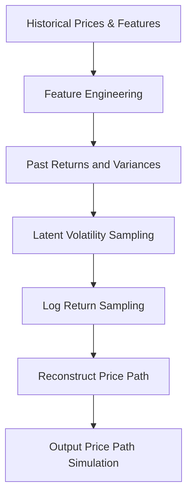
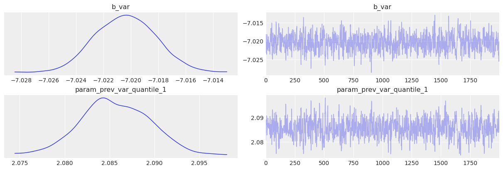
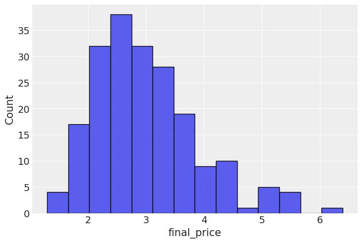

# GARCH-inspire latent volatility model


<!-- WARNING: THIS FILE WAS AUTOGENERATED! DO NOT EDIT! -->

<div>

> **Note**
>
> Generative AI was used to fix grammar in the writing. The rest is done
> by me.

</div>

In the previous post I built a very simple model to demonstrate how log
return dynamics can be learnt from previous noisy observations of
observed returns. The real problem of that approach was that variance
was assumed to be something observed, whereas it is clear that variance
is not something we measure directly.

We do not measure log returns either, but those were sampled, so we
assumed we do not know them. In this post I’m actually going to switch
to modelling latent volatility, which is supposedly a better way to
build this sort of model.

Running a bit ahead of myself, I do think that this sort of modelling
leads to better and more reasonable models, but quantifying these
statements is something we will deal with later on.

This articles describes in details the following flow:

<div>

<figure class=''>

<div>



</div>

</figure>

</div>

## Data loading

We start by loading the data, and examining the returns, log-return
distribution, as well as variance plots. The dataset we are using today
contains heating oil prices from 2010 until May, 2025. The dataset was
pulled from
[investing.com](https://uk.investing.com/commodities/heating-oil).

``` python
source_df = (
    pl.read_csv(
        "./data/heating_oil.csv",
        infer_schema_length=0,
        dtypes={"Price": pl.Utf8},
        columns=["Date", "Price"],
    )
    .with_columns(
        pl.col("Date").str.to_date(format="%m/%d/%Y"),
        pl.col("Price").str.replace_all(",", "").cast(pl.Float64),
    )
    .rename({"Date": "date", "Price": "price"})
    .with_columns(
        ret=pl.col("price") / pl.col("price").shift(1),
    )
).sort("date")
source_df.head()
```

    /var/folders/8s/q13s1_m56g3b3k_1fmdrwn_80000gn/T/ipykernel_20067/1155920622.py:2: DeprecationWarning: The argument `dtypes` for `read_csv` is deprecated. It has been renamed to `schema_overrides`.
      pl.read_csv(

<div><style>
.dataframe > thead > tr,
.dataframe > tbody > tr {
  text-align: right;
  white-space: pre-wrap;
}
</style>
<small>shape: (5, 3)</small>

<table class="dataframe" data-quarto-postprocess="true" data-border="1">
<thead>
<tr>
<th data-quarto-table-cell-role="th">date</th>
<th data-quarto-table-cell-role="th">price</th>
<th data-quarto-table-cell-role="th">ret</th>
</tr>
<tr>
<th>date</th>
<th>f64</th>
<th>f64</th>
</tr>
</thead>
<tbody>
<tr>
<td>2010-04-05</td>
<td>2.2825</td>
<td>0.998775</td>
</tr>
<tr>
<td>2010-04-06</td>
<td>2.2853</td>
<td>1.010703</td>
</tr>
<tr>
<td>2010-04-07</td>
<td>2.2611</td>
<td>1.007396</td>
</tr>
<tr>
<td>2010-04-08</td>
<td>2.2445</td>
<td>1.000401</td>
</tr>
<tr>
<td>2010-04-09</td>
<td>2.2436</td>
<td>1.002771</td>
</tr>
</tbody>
</table>

</div>

``` python
source_df = DataLoader().load_data("data/ng_daily.csv")
source_df
```

<div><style>
.dataframe > thead > tr,
.dataframe > tbody > tr {
  text-align: right;
  white-space: pre-wrap;
}
</style>
<small>shape: (7_060, 3)</small>

<table class="dataframe" data-quarto-postprocess="true" data-border="1">
<thead>
<tr>
<th data-quarto-table-cell-role="th">date</th>
<th data-quarto-table-cell-role="th">price</th>
<th data-quarto-table-cell-role="th">ret</th>
</tr>
<tr>
<th>date</th>
<th>f64</th>
<th>f64</th>
</tr>
</thead>
<tbody>
<tr>
<td>1997-01-07</td>
<td>3.82</td>
<td>null</td>
</tr>
<tr>
<td>1997-01-08</td>
<td>3.8</td>
<td>0.994764</td>
</tr>
<tr>
<td>1997-01-09</td>
<td>3.61</td>
<td>0.95</td>
</tr>
<tr>
<td>1997-01-10</td>
<td>3.92</td>
<td>1.085873</td>
</tr>
<tr>
<td>1997-01-13</td>
<td>4.0</td>
<td>1.020408</td>
</tr>
<tr>
<td>…</td>
<td>…</td>
<td>…</td>
</tr>
<tr>
<td>2025-02-04</td>
<td>3.25</td>
<td>0.984848</td>
</tr>
<tr>
<td>2025-02-05</td>
<td>3.22</td>
<td>0.990769</td>
</tr>
<tr>
<td>2025-02-06</td>
<td>3.31</td>
<td>1.02795</td>
</tr>
<tr>
<td>2025-02-07</td>
<td>3.32</td>
<td>1.003021</td>
</tr>
<tr>
<td>2025-02-10</td>
<td>3.48</td>
<td>1.048193</td>
</tr>
</tbody>
</table>

</div>

## Feature extraction

The class below is implemented to ease off the data analysis and
handling. It produces lagged features for returns and variances, as well
as transforms the data so it is easier to feed into a model.

``` python
feature_engineer = FeatureEngineer(
    transforms=[
        LogReturn(source_field="ret", feature_name="log_ret"),
        Variance(
            source_field="price",
            feature_name="var",
            rolling_variance_window=2,
        ),
        LogReturn(source_field="var", feature_name="log_var", requested_lag=0),
        QuantileTransformer(
            source_field="var", feature_name="var_quantile", requested_lag=1
        ),
    ],
    n_shifts=3,
)
df_with_features = feature_engineer.create_features(source_df)
df_with_features.head()
```

<div><style>
.dataframe > thead > tr,
.dataframe > tbody > tr {
  text-align: right;
  white-space: pre-wrap;
}
</style>
<small>shape: (5, 14)</small>

<table class="dataframe" data-quarto-postprocess="true" data-border="1">
<thead>
<tr>
<th data-quarto-table-cell-role="th">date</th>
<th data-quarto-table-cell-role="th">price</th>
<th data-quarto-table-cell-role="th">ret</th>
<th data-quarto-table-cell-role="th">log_ret</th>
<th data-quarto-table-cell-role="th">var</th>
<th data-quarto-table-cell-role="th">log_var</th>
<th data-quarto-table-cell-role="th">var_quantile</th>
<th data-quarto-table-cell-role="th">prev_log_ret_1</th>
<th data-quarto-table-cell-role="th">prev_log_ret_2</th>
<th data-quarto-table-cell-role="th">prev_log_ret_3</th>
<th data-quarto-table-cell-role="th">prev_var_1</th>
<th data-quarto-table-cell-role="th">prev_var_2</th>
<th data-quarto-table-cell-role="th">prev_var_3</th>
<th data-quarto-table-cell-role="th">prev_var_quantile_1</th>
</tr>
<tr>
<th>date</th>
<th>f64</th>
<th>f64</th>
<th>f64</th>
<th>f64</th>
<th>f64</th>
<th>f64</th>
<th>f64</th>
<th>f64</th>
<th>f64</th>
<th>f64</th>
<th>f64</th>
<th>f64</th>
<th>f64</th>
</tr>
</thead>
<tbody>
<tr>
<td>1997-01-13</td>
<td>4.0</td>
<td>1.020408</td>
<td>0.020203</td>
<td>0.0032</td>
<td>-5.744604</td>
<td>0.511527</td>
<td>0.082384</td>
<td>-0.051293</td>
<td>-0.005249</td>
<td>0.04805</td>
<td>0.01805</td>
<td>0.0002</td>
<td>0.905906</td>
</tr>
<tr>
<td>1997-01-14</td>
<td>4.01</td>
<td>1.0025</td>
<td>0.002497</td>
<td>0.0001</td>
<td>-9.21034</td>
<td>0.0</td>
<td>0.020203</td>
<td>0.082384</td>
<td>-0.051293</td>
<td>0.0032</td>
<td>0.04805</td>
<td>0.01805</td>
<td>0.511527</td>
</tr>
<tr>
<td>1997-01-15</td>
<td>4.34</td>
<td>1.082294</td>
<td>0.079083</td>
<td>0.05445</td>
<td>-2.910472</td>
<td>0.915916</td>
<td>0.002497</td>
<td>0.020203</td>
<td>0.082384</td>
<td>0.0001</td>
<td>0.0032</td>
<td>0.04805</td>
<td>0.0</td>
</tr>
<tr>
<td>1997-01-16</td>
<td>4.71</td>
<td>1.085253</td>
<td>0.081814</td>
<td>0.06845</td>
<td>-2.681652</td>
<td>0.929968</td>
<td>0.079083</td>
<td>0.002497</td>
<td>0.020203</td>
<td>0.05445</td>
<td>0.0001</td>
<td>0.0032</td>
<td>0.915916</td>
</tr>
<tr>
<td>1997-01-17</td>
<td>3.91</td>
<td>0.830149</td>
<td>-0.186151</td>
<td>0.32</td>
<td>-1.139434</td>
<td>0.984985</td>
<td>0.081814</td>
<td>0.079083</td>
<td>0.002497</td>
<td>0.06845</td>
<td>0.05445</td>
<td>0.0001</td>
<td>0.929968</td>
</tr>
</tbody>
</table>

</div>

``` python
sns.histplot(df_with_features, x="log_ret")
sns.histplot(df_with_features, x="ret")
plt.xlim([-1, 2])
```


``` python
plt.figure(figsize=(16, 6))
sns.lineplot(df_with_features, x="date", y="price")
plt.figure(figsize=(16, 6))
sns.lineplot(df_with_features, x="date", y="log_ret")
```


## The model

I will now demonstrate how one can build a latent volatility model that
can then be used to sample new observations in an autoregressive manner.
The main change here is that the volatility is not a linear function
anymore, like it used to be, but it is a latent variable sampled along
with the log return. Still, a limitation remains for this model that we
do condition our latent volatility on the observed noisy variable. Worth
noting, that we assume a latent volatility variable per time step,
meaning we will end up with a latent volatility variable that has the
length of the original time series.

As before, the log return is sampled from Student T distribution so
account for potentially heavier tails. Other than that, we still use
Monte Carlo to build an idea for posterior distributions. Despite a
relatively long time series, the below model sampling is quite
efficient, so should converge fast.

``` python
# Cut-off point
T = 300
present_value_log_ret, present_value_log_var, present_value_test = (
    df_with_features["log_ret"][:-T].to_numpy(),
    df_with_features["log_var"][:-T].to_numpy(),
    df_with_features["log_ret"][-T:].to_numpy(),
)
past_values_train, past_values_test = (
    feature_engineer.to_numpy_dict(df_with_features[:-T]),
    feature_engineer.to_numpy_dict(df_with_features[-T:]),
)
```

------------------------------------------------------------------------

### garch_like_sample_vol_model

>  garch_like_sample_vol_model (value_log_ret:numpy.ndarray[typing.Any,numpy
>                                   .dtype[+_ScalarType_co]]=None, log_var_value
>                                   :numpy.ndarray[typing.Any,numpy.dtype[+_Scal
>                                   arType_co]]=None, past_values:dict[str,numpy
>                                   .ndarray[typing.Any,numpy.dtype[+_ScalarType
>                                   _co]]]=None)

``` python
numpyro.render_model(
    garch_like_sample_vol_model,
    model_args=(
        present_value_log_ret,
        present_value_log_var,
        past_values_train,
    ),
)
```


``` python
rng_key = random.PRNGKey(0)
rng_key, rng_key_ = random.split(rng_key)

# Run NUTS.
kernel = NUTS(garch_like_sample_vol_model)
num_samples = 2000
mcmc = MCMC(kernel, num_warmup=1000, num_samples=num_samples)

mcmc.run(
    rng_key_,
    present_value_log_ret,
    present_value_log_var,
    past_values_train,
)
mcmc.print_summary()
posterior_samples = mcmc.get_samples()
print(posterior_samples.keys())
```

    sample: 100%|██████████| 3000/3000 [00:01<00:00, 2140.04it/s, 11 steps of size 2.40e-01. acc. prob=0.92]


                                     mean       std    median      5.0%     95.0%     n_eff     r_hat
                          b_var     -7.02      0.00     -7.02     -7.02     -7.02    663.62      1.00
      param_prev_var_quantile_1      2.09      0.00      2.09      2.08      2.09    625.89      1.00

    Number of divergences: 0
    dict_keys(['b_var', 'log_ret_var', 'param_prev_var_quantile_1'])

## Post-fitting checks

``` python
posterior_samples = mcmc.get_samples()
predictive = Predictive(
    garch_like_sample_vol_model,
    posterior_samples=posterior_samples,
    return_sites=["log_ret"],  # or whatever your observation site is called
)
rng_key, rng_key_ppc = random.split(rng_key)
ppc_samples = predictive(
    rng_key_ppc,
    present_value_log_ret,
    present_value_log_var,
    past_values_train,
)
prior_samples = Predictive(garch_like_sample_vol_model, num_samples=2000)(
    rng_key,
    present_value_log_ret,
    present_value_log_var,
    past_values_train,
)

idata = az.from_numpyro(mcmc, posterior_predictive=ppc_samples, prior=prior_samples)
```

``` python
az.plot_trace(idata, var_names=["~^log_ret_var"], filter_vars="regex");
```



## Future paths simulations

Finally, we are able to run the autoregressive simulation and look at
the distribution of the final prices. Let’s look at the average sample
error for each of the run id. We then can compare the average spread
relative to the

``` python
simulator = Simulator(
    model=garch_like_sample_vol_model,
    feature_engineer=feature_engineer,
)
posterior_for_gen = {k: ps[0:1] for k, ps in posterior_samples.items()}
del posterior_for_gen["log_ret_var"]
starting_sim_df = source_df[-T - feature_engineer.n_shifts * 5 - 50 : -T]
all_runs = simulator.simulate_paths(
    steps=30,
    starting_sim_df=starting_sim_df,
    posterior_samples=posterior_for_gen,
    num_sims=200,
)
sns.lineplot(all_runs, x="date", y="price", hue="run_id")
plt.xticks(rotation=90);
```


## Model validation & predictive accuracy

I now turn my attention to testing the predictive power of the model.
Posterior checks are good and fun, but the model is autoregressive in
nature, so what needs to happen is we need to roll through out test set,
simulate a distribution of forward looking prices, then do boxplots,
with the predicted price distributions and the actual price inside those
boxes. The purpose of this exercise is to see if the actual price tends
to be within the range of prices that comes out of simulations.

In a no volatility perfectly almost perfectly predictable world, the
boxes would be very tight around the actual observations, but
realistically there is going to be a lot of wiggle room inside.

``` python
target_window = 7
simulator = Simulator(
    model=garch_like_sample_vol_model, feature_engineer=feature_engineer
)
posterior_for_gen = {k: ps[0:1] for k, ps in posterior_samples.items()}
shifts = list(range(0, T, 10))
all_lasts = []
actual_prices = []
for ct, t in tqdm(enumerate(shifts), total=len(shifts)):
    # print(f"Simulating shift {ct}/{len(shifts)}")
    starting_sim_df = source_df[-T - feature_engineer.n_shifts * 5 - 50 + t : -T + t]
    this_sim = simulator.simulate_paths(
        steps=target_window,
        starting_sim_df=starting_sim_df,
        posterior_samples=posterior_for_gen,
        num_sims=50,
    )
    last_prices = (
        this_sim.sort("date")  # Ensure dates are in correct order
        .group_by("run_id")
        .agg(pl.col("price").last())  # Get the last price for each run
        .rename({"price": "final_price"})
        .with_columns(pl.lit(ct).alias("run_id"))
    )
    actual_prices.append({"run_id": ct, "actual_price": source_df[-T + t]["price"][0]})
    all_lasts.append(last_prices)
all_lasts = pl.concat(all_lasts)
actual_prices = pl.DataFrame(actual_prices)
```

    100%|██████████| 30/30 [00:25<00:00,  1.19it/s]

``` python
sns.boxplot(data=all_lasts, x="run_id", y="final_price")
sns.scatterplot(data=actual_prices, x="run_id", y="actual_price", zorder=10)
plt.ylim([0, 6])
```


We can finally see that the mean error on the observed values is 25%
lower than in the previous version.

``` python
all_lasts.join(
    actual_prices, left_on="run_id", right_on="run_id", how="left"
).with_columns(error=(pl.col("final_price") - pl.col("actual_price")) ** 2).group_by(
    "run_id"
).agg(pl.col("error").mean())["error"].median()
```

    0.08732833325394218

## Option pricing

Next, we calculate the call option payoff distributions, as well as
model-implied option prices.

``` python
last_prices = (
    all_runs.sort("date")  # Ensure dates are in correct order
    .group_by("run_id")
    .agg(pl.col("price").last())  # Get the last price for each run
    .rename({"price": "final_price"})
)
sns.histplot(last_prices, x="final_price")
```



``` python
strike_prices = [2.5, 3.0, 3.5, 4.0]

# Create a list of DataFrames, one per strike
payoff_dfs = [
    last_prices.with_columns(
        payoff_at_expiry=(pl.col("final_price") - strike).clip(0),
        strike=pl.lit(strike),  # so we can track which row belongs to which strike
    )
    for strike in strike_prices
]

# Concatenate into one big DataFrame
payoff_df_all = pl.concat(payoff_dfs)
plt.figure(figsize=(12, 6))
sns.histplot(
    data=payoff_df_all,
    x="payoff_at_expiry",
    hue="strike",
    element="step",
    stat="count",
    bins=40,
)
plt.title("Call Option Payoff Distribution at Expiry")
plt.xlabel("Payoff at Expiry")
plt.ylabel("Count")
plt.grid(True)
plt.show()
```


``` python
# Group and average payoff per strike
implied_prices = payoff_df_all.group_by("strike").agg(pl.col("payoff_at_expiry").mean())

# Plot the pricing curve
plt.figure(figsize=(10, 5))
sns.lineplot(data=implied_prices, x="strike", y="payoff_at_expiry", marker="o")
plt.title("Model-Implied Call Option Prices vs Strike")
plt.xlabel("Strike Price")
plt.ylabel("Fair Price (Expected Payoff)")
plt.grid(True)
plt.show()
```


In this post I have implemented a latent volatility model, which has a
measurable improvement in predictive power for future price scenarios.
In the next post I will demonstrate how energy commodities storage
levels can be incorporated into this model.

## Limitations & Next Steps

- The model assumes latent volatility follows a stationary process,
  which may not hold in extreme market events.
- Does not yet incorporate external factors (e.g., inventory levels,
  macro data).
- Model not benchmarked against market-implied volatility surfaces.
- Future work: extend to multivariate commodities or test on real-world
  options datasets.
- This is a research-grade toy model; do not use for actual trading
  decisions.

## Further reading

- [Previous article: A Bayesian GARCH-Inspired Volatility Model for
  Energy Commodities Option Pricing](garch_like_modelling.html)
- [Original GARCH
  paper](https://public.econ.duke.edu/~boller/Published_Papers/joe_86.pdf)
- [NumPyro
  docs](https://num.pyro.ai/en/latest/index.html#introductory-tutorials)
