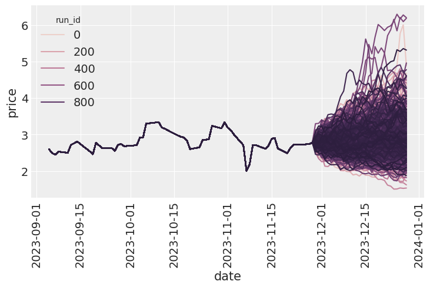
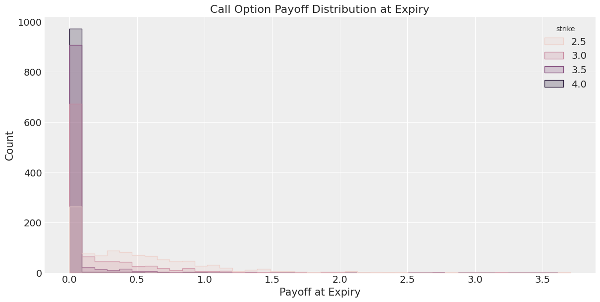
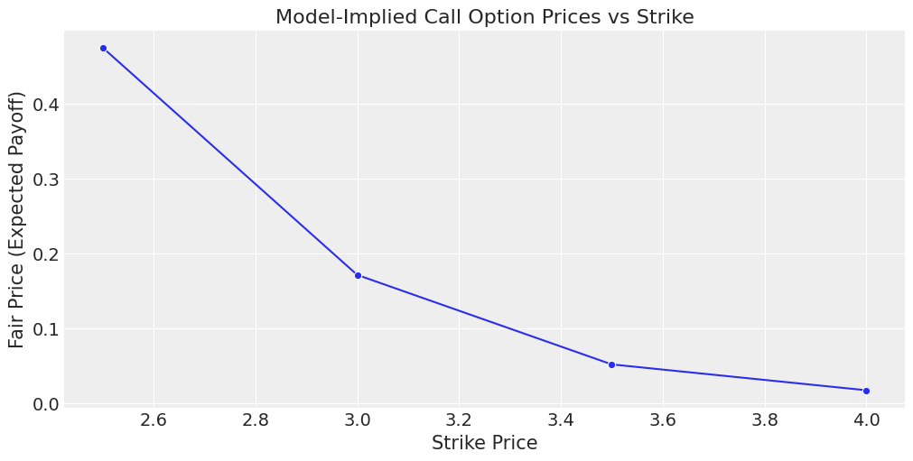

# Applications of bayesian modelling in finance

<!-- WARNING: THIS FILE WAS AUTOGENERATED! DO NOT EDIT! -->

## GARCH-like model

This project explores a generative approach to pricing natural gas
options using a Bayesian GARCH-inspired model. It uses NumPyro to model
volatility dynamics from historical data, simulates future prices, and
estimates option payoffs under different strike scenarios.

It’s not a production-grade system, but a sandbox to understand how
volatility-aware models behave—and how they might be extended further.

I decided to go for the following process of modelling the log returns:

$$
\begin{align\*}
\log r_t &\sim \mathcal{N}(\mu_t, \sigma_t^2) \\
\mu_t &= \alpha_0 + \sum\_{i=1}^S \alpha_i \log r\_{t-i} \\
\sigma_t^2 &= \beta_0 + \sum\_{i=1}^S \beta_i \sigma\_{t-i}^2
\end{align\*}
$$

- 📊 Loads and engineers features from natural gas price time series
- ⚙️ Bayesian model for log returns and autoregressive variance
- 🔁 Generates future price paths via simulation
- 💰 Computes call option payoffs & model-implied prices
- 🔍 Fully implemented in NumPyro with MCMC inference

### Simulated Price Paths

<figure>

<figcaption aria-hidden="true">pricepath.png</figcaption>
</figure>

### Call Option Payoffs at Expiry

<figure>

<figcaption aria-hidden="true">callpayoffatexpiry.png</figcaption>
</figure>

### Model-Implied Option Prices vs Strike

<figure>

<figcaption aria-hidden="true">model-implied-price.png</figcaption>
</figure>
