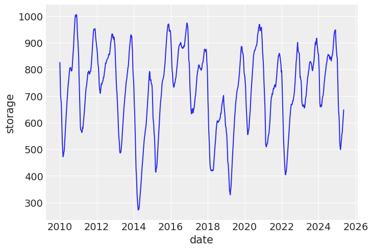
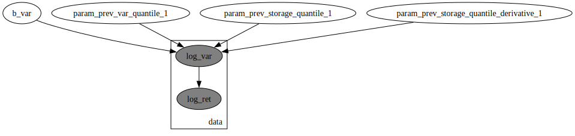
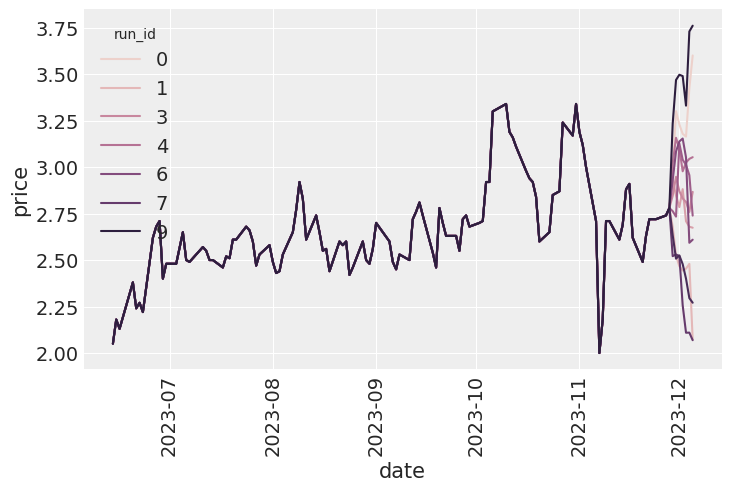
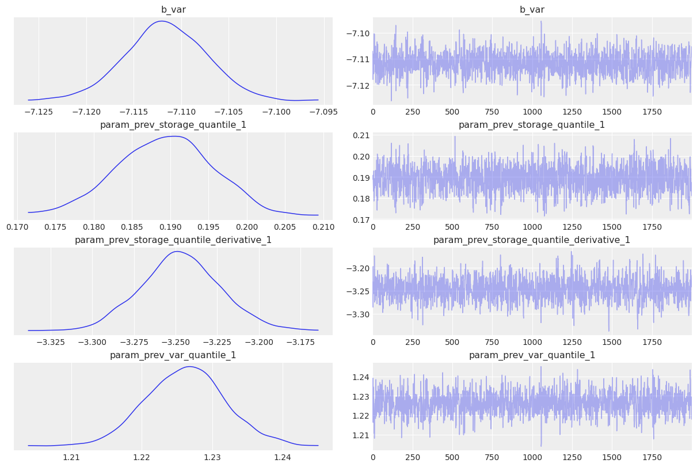
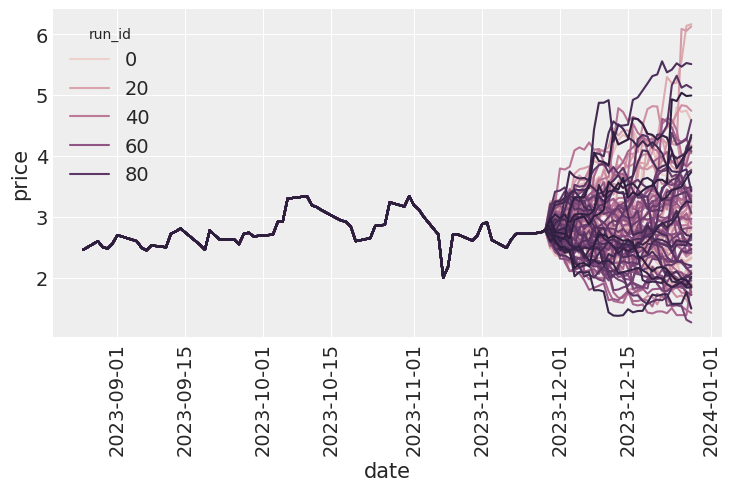
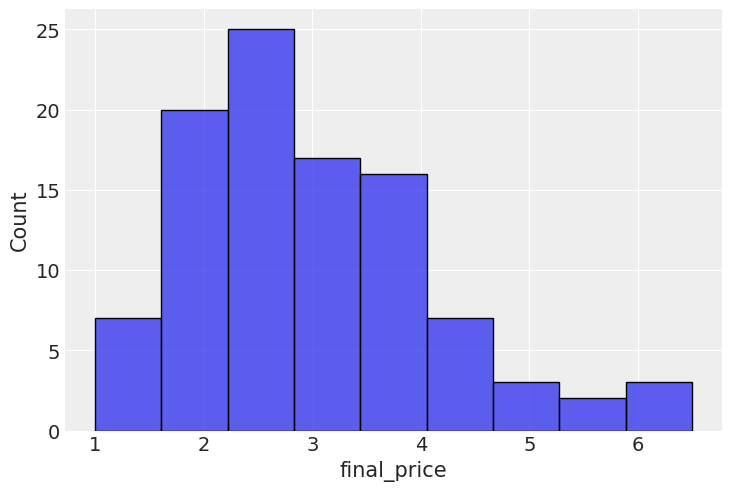
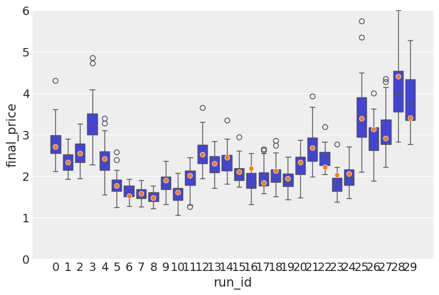
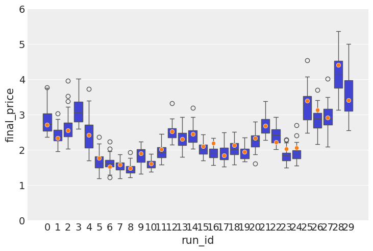

# Using storage information to model Henry Hub Gas prices


<!-- WARNING: THIS FILE WAS AUTOGENERATED! DO NOT EDIT! -->

<div>

> **Note**
>
> Generative AI was used to fix grammar in the writing. The rest is done
> by me.

</div>

In the previous post I built a latent volatility model that was used to
predict Henry Hub gas prices. While it was a very simple model, it did
output meaningful results in the end. One of the fundamental problems
with that kind of model is that it makes no assumption on the nature of
the underlying time series. It could just as easily be modeling sheep
populations in New Zealand.. Today I’m making the first step in
addressing that by including a fundamental macro indicator - reported
levels of gas storage, collected by [US Energy Information
Administration](https://www.eia.gov/). I’d recommend anyone to spend
like 30 mins on their website - the amount of historical information on
energy is amazing and it’s a great resource all around.

The reason I decided to start with storage information is because it is
a very strong indicator of the volatility. Depending on weather
forecasts, the current levels of storage and other events, volatility
goes up and down. For example, in warmer months, NG volatility tends to
be lower(unless snow hits Texas), and in colder months when sudden
frosts hit, the volatility will increase, as there is more demand for an
already depleted commodity.

## EIA gas report

On a [weekly](https://ir.eia.gov/ngs/ngs.html) basis, EIA
[collects](https://ir.eia.gov/ngs/methodology.html) information about
gas storage levels. I will use storage level information from the lower
48 states. And while, there are other massive storages on other
continents, US, on its own, being a massive energy market provides a
valuable insight into future volatility values.

## How to include storage levels

Within the bayesian framework, there are a few ways to include the
storage information. First of all, the EIA methodology document states
that the parties reporting their storage levels are sampled, meaning
that from week to week we do not get reports from the same parties.
Plus, while it is unclear how much evidence there is, it would
reasonable to assume that there inaccuracies in those reports. With that
in mind, my initial idea was to model the storage levels as a variable
with noisy observation, and consider it a latent variable that was
periodically observed. That would lead to a two-level bayesian model.
However, our NG prices dataset is on the daily basis and the storage
reports are on the weekly basis, making it unclear how exactly those two
should be aligned, in case the storage information is assumed a latent
variable.

I then decided to use it as an external regressor and leave the more
complicated version for future trials. Additionally, I include storage
level derivative into the modelling since I found that it helps to make
the model more stable, plus conceptually it also makes sense that
information about the speed of storage change and its direction are
important.

``` python
```

    The autoreload extension is already loaded. To reload it, use:
      %reload_ext autoreload

## Data loading

Start with loading the daily level gas data

``` python
gas_data = (
    pl.read_csv("data/ng_daily.csv", try_parse_dates=True)
    .drop_nulls()
    .tail(3500)
    .rename({"Date": "date", "Price": "price"})
).with_columns(
    ret=pl.col("price") / pl.col("price").shift(1),
)
gas_data
```

<div><style>
.dataframe > thead > tr,
.dataframe > tbody > tr {
  text-align: right;
  white-space: pre-wrap;
}
</style>
<small>shape: (3_500, 3)</small>

<table class="dataframe" data-quarto-postprocess="true" data-border="1">
<thead>
<tr>
<th data-quarto-table-cell-role="th">date</th>
<th data-quarto-table-cell-role="th">price</th>
<th data-quarto-table-cell-role="th">ret</th>
</tr>
<tr>
<th>date</th>
<th>f64</th>
<th>f64</th>
</tr>
</thead>
<tbody>
<tr>
<td>2011-04-01</td>
<td>4.32</td>
<td>null</td>
</tr>
<tr>
<td>2011-04-04</td>
<td>4.21</td>
<td>0.974537</td>
</tr>
<tr>
<td>2011-04-05</td>
<td>4.22</td>
<td>1.002375</td>
</tr>
<tr>
<td>2011-04-06</td>
<td>4.17</td>
<td>0.988152</td>
</tr>
<tr>
<td>2011-04-07</td>
<td>4.12</td>
<td>0.98801</td>
</tr>
<tr>
<td>…</td>
<td>…</td>
<td>…</td>
</tr>
<tr>
<td>2025-02-04</td>
<td>3.25</td>
<td>0.984848</td>
</tr>
<tr>
<td>2025-02-05</td>
<td>3.22</td>
<td>0.990769</td>
</tr>
<tr>
<td>2025-02-06</td>
<td>3.31</td>
<td>1.02795</td>
</tr>
<tr>
<td>2025-02-07</td>
<td>3.32</td>
<td>1.003021</td>
</tr>
<tr>
<td>2025-02-10</td>
<td>3.48</td>
<td>1.048193</td>
</tr>
</tbody>
</table>

</div>

I then load storage data, focusing only on the lower 48 states. The
relevant column is renamed to storage for convenience.

``` python
ng_storage_data = (
    pl.read_csv("data/ng_storage.csv", truncate_ragged_lines=True)
    .with_columns(
        pl.col("Week ending").str.strptime(pl.Datetime, "%d-%b-%y").alias("date"),
    )
    .with_columns(pl.col("date").cast(pl.Date))
    .rename({"Total Lower 48": "storage"})
)
ng_storage_data.head()
```

<div><style>
.dataframe > thead > tr,
.dataframe > tbody > tr {
  text-align: right;
  white-space: pre-wrap;
}
</style>
<small>shape: (5, 10)</small>

<table class="dataframe" data-quarto-postprocess="true" data-border="1">
<thead>
<tr>
<th data-quarto-table-cell-role="th">Week ending</th>
<th data-quarto-table-cell-role="th">Source</th>
<th data-quarto-table-cell-role="th">East Region</th>
<th data-quarto-table-cell-role="th">Midwest Region Mountain Region</th>
<th data-quarto-table-cell-role="th">Pacific Region</th>
<th data-quarto-table-cell-role="th">South Central Region</th>
<th data-quarto-table-cell-role="th">Salt</th>
<th data-quarto-table-cell-role="th">NonSalt</th>
<th data-quarto-table-cell-role="th">storage</th>
<th data-quarto-table-cell-role="th">date</th>
</tr>
<tr>
<th>str</th>
<th>str</th>
<th>i64</th>
<th>i64</th>
<th>i64</th>
<th>i64</th>
<th>i64</th>
<th>i64</th>
<th>i64</th>
<th>date</th>
</tr>
</thead>
<tbody>
<tr>
<td>"01-Jan-10"</td>
<td>"Derived EIA Weekly Estimates"</td>
<td>769</td>
<td>900</td>
<td>195</td>
<td>268</td>
<td>985</td>
<td>159</td>
<td>826</td>
<td>2010-01-01</td>
</tr>
<tr>
<td>"08-Jan-10"</td>
<td>"Derived EIA Weekly Estimates"</td>
<td>703</td>
<td>820</td>
<td>185</td>
<td>257</td>
<td>886</td>
<td>123</td>
<td>763</td>
<td>2010-01-08</td>
</tr>
<tr>
<td>"15-Jan-10"</td>
<td>"Derived EIA Weekly Estimates"</td>
<td>642</td>
<td>750</td>
<td>176</td>
<td>246</td>
<td>793</td>
<td>91</td>
<td>702</td>
<td>2010-01-15</td>
</tr>
<tr>
<td>"22-Jan-10"</td>
<td>"Derived EIA Weekly Estimates"</td>
<td>616</td>
<td>710</td>
<td>171</td>
<td>235</td>
<td>789</td>
<td>102</td>
<td>687</td>
<td>2010-01-22</td>
</tr>
<tr>
<td>"29-Jan-10"</td>
<td>"Derived EIA Weekly Estimates"</td>
<td>582</td>
<td>661</td>
<td>164</td>
<td>221</td>
<td>779</td>
<td>108</td>
<td>671</td>
<td>2010-01-29</td>
</tr>
</tbody>
</table>

</div>

Here is what storage dynamic look like:

``` python
sns.lineplot(ng_storage_data, x="date", y="storage")
```



Finally, joining both frames into one.

``` python
gas_storage_data = gas_data.join(
    ng_storage_data["date", "storage"], how="left", on="date"
).with_columns(pl.col("storage").forward_fill())
gas_storage_data.head()
```

<div><style>
.dataframe > thead > tr,
.dataframe > tbody > tr {
  text-align: right;
  white-space: pre-wrap;
}
</style>
<small>shape: (5, 4)</small>

<table class="dataframe" data-quarto-postprocess="true" data-border="1">
<thead>
<tr>
<th data-quarto-table-cell-role="th">date</th>
<th data-quarto-table-cell-role="th">price</th>
<th data-quarto-table-cell-role="th">ret</th>
<th data-quarto-table-cell-role="th">storage</th>
</tr>
<tr>
<th>date</th>
<th>f64</th>
<th>f64</th>
<th>i64</th>
</tr>
</thead>
<tbody>
<tr>
<td>2011-04-01</td>
<td>4.32</td>
<td>null</td>
<td>578</td>
</tr>
<tr>
<td>2011-04-04</td>
<td>4.21</td>
<td>0.974537</td>
<td>578</td>
</tr>
<tr>
<td>2011-04-05</td>
<td>4.22</td>
<td>1.002375</td>
<td>578</td>
</tr>
<tr>
<td>2011-04-06</td>
<td>4.17</td>
<td>0.988152</td>
<td>578</td>
</tr>
<tr>
<td>2011-04-07</td>
<td>4.12</td>
<td>0.98801</td>
<td>578</td>
</tr>
</tbody>
</table>

</div>

I use my feature engineer class to extract the following features:

1.  Log-return
2.  Log-variance
3.  Storage and variance quantiles
4.  Storage quantile derivative

I use quantiles pretty much everywhere, because it is good way to
standardise the data and still leave a lot of useful information in the
transformed variable. If the value is 0.99, you know it’s a rare event,
which is useful for debugging.

``` python
feature_engineer = FeatureEngineer(
    drop_nulls=False,
    transforms=[
        LogReturn(source_field="ret", feature_name="log_ret"),
        Variance(
            source_field="price",
            feature_name="var",
            rolling_variance_window=2,
        ),
        LogReturn(source_field="var", feature_name="log_var", requested_lag=0),
        QuantileTransformer(
            source_field="var", feature_name="var_quantile", requested_lag=1
        ),
        QuantileTransformer(
            source_field="storage",
            feature_name="storage_quantile",
            step_size=8,
            requested_lag=1,
        ),
        Derivative(
            source_field="storage_quantile",
            feature_name="storage_quantile_derivative",
            step_size=8,
            requested_lag=1,
        ),
    ],
    n_shifts=3,
)
df_with_features = feature_engineer.create_features(gas_storage_data)
df_with_features = df_with_features.drop_nulls()
df_with_features
```

<div><style>
.dataframe > thead > tr,
.dataframe > tbody > tr {
  text-align: right;
  white-space: pre-wrap;
}
</style>
<small>shape: (3_484, 20)</small>

<table class="dataframe" data-quarto-postprocess="true" data-border="1">
<thead>
<tr>
<th data-quarto-table-cell-role="th">date</th>
<th data-quarto-table-cell-role="th">price</th>
<th data-quarto-table-cell-role="th">ret</th>
<th data-quarto-table-cell-role="th">storage</th>
<th data-quarto-table-cell-role="th">log_ret</th>
<th data-quarto-table-cell-role="th">var</th>
<th data-quarto-table-cell-role="th">log_var</th>
<th data-quarto-table-cell-role="th">var_quantile</th>
<th data-quarto-table-cell-role="th">storage_quantile</th>
<th data-quarto-table-cell-role="th">storage_quantile_derivative</th>
<th data-quarto-table-cell-role="th">month</th>
<th data-quarto-table-cell-role="th">prev_log_ret_1</th>
<th data-quarto-table-cell-role="th">prev_log_ret_2</th>
<th data-quarto-table-cell-role="th">prev_log_ret_3</th>
<th data-quarto-table-cell-role="th">prev_var_1</th>
<th data-quarto-table-cell-role="th">prev_var_2</th>
<th data-quarto-table-cell-role="th">prev_var_3</th>
<th data-quarto-table-cell-role="th">prev_var_quantile_1</th>
<th data-quarto-table-cell-role="th">prev_storage_quantile_1</th>
<th
data-quarto-table-cell-role="th">prev_storage_quantile_derivative_1</th>
</tr>
<tr>
<th>date</th>
<th>f64</th>
<th>f64</th>
<th>i64</th>
<th>f64</th>
<th>f64</th>
<th>f64</th>
<th>f64</th>
<th>f64</th>
<th>f64</th>
<th>i8</th>
<th>f64</th>
<th>f64</th>
<th>f64</th>
<th>f64</th>
<th>f64</th>
<th>f64</th>
<th>f64</th>
<th>f64</th>
<th>f64</th>
</tr>
</thead>
<tbody>
<tr>
<td>2011-04-26</td>
<td>4.32</td>
<td>0.988558</td>
<td>610</td>
<td>-0.011508</td>
<td>0.00125</td>
<td>-6.684612</td>
<td>0.470952</td>
<td>0.22973</td>
<td>0.027528</td>
<td>3</td>
<td>0.009195</td>
<td>0.0</td>
<td>0.032867</td>
<td>0.0008</td>
<td>0.0001</td>
<td>0.0098</td>
<td>0.411746</td>
<td>0.202202</td>
<td>0.019019</td>
</tr>
<tr>
<td>2011-04-27</td>
<td>4.35</td>
<td>1.006944</td>
<td>610</td>
<td>0.00692</td>
<td>0.00045</td>
<td>-7.706263</td>
<td>0.340426</td>
<td>0.22973</td>
<td>0.027528</td>
<td>3</td>
<td>-0.011508</td>
<td>0.009195</td>
<td>0.0</td>
<td>0.00125</td>
<td>0.0008</td>
<td>0.0001</td>
<td>0.470952</td>
<td>0.202202</td>
<td>0.019019</td>
</tr>
<tr>
<td>2011-04-28</td>
<td>4.38</td>
<td>1.006897</td>
<td>610</td>
<td>0.006873</td>
<td>0.00045</td>
<td>-7.706263</td>
<td>0.340574</td>
<td>0.22973</td>
<td>0.0</td>
<td>3</td>
<td>0.00692</td>
<td>-0.011508</td>
<td>0.009195</td>
<td>0.00045</td>
<td>0.00125</td>
<td>0.0008</td>
<td>0.340426</td>
<td>0.22973</td>
<td>0.046547</td>
</tr>
<tr>
<td>2011-04-29</td>
<td>4.51</td>
<td>1.02968</td>
<td>640</td>
<td>0.029248</td>
<td>0.00845</td>
<td>-4.773589</td>
<td>0.770854</td>
<td>0.264765</td>
<td>0.035035</td>
<td>3</td>
<td>0.006873</td>
<td>0.00692</td>
<td>-0.011508</td>
<td>0.00045</td>
<td>0.00045</td>
<td>0.00125</td>
<td>0.340574</td>
<td>0.22973</td>
<td>0.046547</td>
</tr>
<tr>
<td>2011-05-02</td>
<td>4.6</td>
<td>1.019956</td>
<td>640</td>
<td>0.019759</td>
<td>0.00405</td>
<td>-5.509038</td>
<td>0.658659</td>
<td>0.264765</td>
<td>0.035035</td>
<td>4</td>
<td>0.029248</td>
<td>0.006873</td>
<td>0.00692</td>
<td>0.00845</td>
<td>0.00045</td>
<td>0.00045</td>
<td>0.770854</td>
<td>0.22973</td>
<td>0.046547</td>
</tr>
<tr>
<td>…</td>
<td>…</td>
<td>…</td>
<td>…</td>
<td>…</td>
<td>…</td>
<td>…</td>
<td>…</td>
<td>…</td>
<td>…</td>
<td>…</td>
<td>…</td>
<td>…</td>
<td>…</td>
<td>…</td>
<td>…</td>
<td>…</td>
<td>…</td>
<td>…</td>
<td>…</td>
</tr>
<tr>
<td>2025-02-04</td>
<td>3.25</td>
<td>0.984848</td>
<td>638</td>
<td>-0.015267</td>
<td>0.00125</td>
<td>-6.684612</td>
<td>0.47869</td>
<td>0.261762</td>
<td>-0.200701</td>
<td>1</td>
<td>0.11892</td>
<td>-0.062831</td>
<td>-0.080043</td>
<td>0.06845</td>
<td>0.01805</td>
<td>0.0338</td>
<td>0.951502</td>
<td>0.462462</td>
<td>-0.115616</td>
</tr>
<tr>
<td>2025-02-05</td>
<td>3.22</td>
<td>0.990769</td>
<td>638</td>
<td>-0.009274</td>
<td>0.00045</td>
<td>-7.706263</td>
<td>0.347916</td>
<td>0.261762</td>
<td>-0.074074</td>
<td>1</td>
<td>-0.015267</td>
<td>0.11892</td>
<td>-0.062831</td>
<td>0.00125</td>
<td>0.06845</td>
<td>0.01805</td>
<td>0.47869</td>
<td>0.335836</td>
<td>-0.242242</td>
</tr>
<tr>
<td>2025-02-06</td>
<td>3.31</td>
<td>1.02795</td>
<td>638</td>
<td>0.027567</td>
<td>0.00405</td>
<td>-5.509038</td>
<td>0.662417</td>
<td>0.261762</td>
<td>-0.074074</td>
<td>1</td>
<td>-0.009274</td>
<td>-0.015267</td>
<td>0.11892</td>
<td>0.00045</td>
<td>0.00125</td>
<td>0.06845</td>
<td>0.347916</td>
<td>0.335836</td>
<td>-0.242242</td>
</tr>
<tr>
<td>2025-02-07</td>
<td>3.32</td>
<td>1.003021</td>
<td>624</td>
<td>0.003017</td>
<td>0.0001</td>
<td>-9.21034</td>
<td>0.0</td>
<td>0.241742</td>
<td>-0.094094</td>
<td>1</td>
<td>0.027567</td>
<td>-0.009274</td>
<td>-0.015267</td>
<td>0.00405</td>
<td>0.00045</td>
<td>0.00125</td>
<td>0.662417</td>
<td>0.335836</td>
<td>-0.242242</td>
</tr>
<tr>
<td>2025-02-10</td>
<td>3.48</td>
<td>1.048193</td>
<td>624</td>
<td>0.047068</td>
<td>0.0128</td>
<td>-4.35831</td>
<td>0.831581</td>
<td>0.241742</td>
<td>-0.094094</td>
<td>1</td>
<td>0.003017</td>
<td>0.027567</td>
<td>-0.009274</td>
<td>0.0001</td>
<td>0.00405</td>
<td>0.00045</td>
<td>0.0</td>
<td>0.335836</td>
<td>-0.242242</td>
</tr>
</tbody>
</table>

</div>

``` python
# Cut-off point
T = 300
(
    present_value_log_ret,
    present_value_log_var,
    storage,
    month,
    present_value_test,
) = (
    df_with_features["log_ret"][:-T].to_numpy(),
    df_with_features["log_var"][:-T].to_numpy(),
    df_with_features["storage_quantile"][:-T].to_numpy(),
    df_with_features["month"][:-T].to_numpy(),
    df_with_features["log_ret"][-T:].to_numpy(),
)
past_values_train, past_values_test = (
    feature_engineer.to_numpy_dict(df_with_features[:-T]),
    feature_engineer.to_numpy_dict(df_with_features[-T:]),
)
```

## Model definition

The model is defined in the same way it was described above.

------------------------------------------------------------------------

### garch_like_sample_vol_model

>  garch_like_sample_vol_model (value_log_ret:numpy.ndarray[typing.Any,numpy
>                                   .dtype[+_ScalarType_co]]=None, log_var_value
>                                   :numpy.ndarray[typing.Any,numpy.dtype[+_Scal
>                                   arType_co]]=None, storage:numpy.ndarray[typi
>                                   ng.Any,numpy.dtype[+_ScalarType_co]]=None, m
>                                   onth:numpy.ndarray[typing.Any,numpy.dtype[+_
>                                   ScalarType_co]]=None, past_values:dict[str,n
>                                   umpy.ndarray[typing.Any,numpy.dtype[+_Scalar
>                                   Type_co]]]=None)

``` python
numpyro.render_model(
    garch_like_sample_vol_model,
    model_args=(
        present_value_log_ret,
        present_value_log_var,
        storage,
        month,
        past_values_train,
    ),
)
```



The first order of business is to do PPC - prior predictive checks. In
out case, I deal with data in the temporal domain, hence our checks will
be autoregressive too. What I mainly want to check here is that with the
current prior I do not get explosive time series, and they stay within a
reasonable level. On the image below, you can see, that this is indeed
the case.

Though PPCs are very useful in general, practically speaking, if you
have a lot of observations, bad prior will be overcome by those data.
This is the case for this model too: I tried to set unreasonable priors
and the model would converge to the same values again and again. That’s
because there are thousands of samples. Nonetheless, it is a good
practice and I do it.

``` python
simulator = Simulator(
    model=garch_like_sample_vol_model,
    feature_engineer=feature_engineer,
    exo_fixed_effects=["month"],
    inherit_vals=["storage"],
)
starting_sim_df = gas_storage_data[-T - feature_engineer.n_shifts * 5 - 100 : -T]
all_runs = simulator.simulate_paths(
    steps=7,
    starting_sim_df=starting_sim_df,
    posterior_samples=None,
    num_sims=10,
)

sns.lineplot(all_runs, x="date", y="price", hue="run_id")
plt.xticks(rotation=90);
```



## Fitting and diagnostics

The model is fitted using MCMC. You can see that estimates are
relatively tight. Note, how the derivative is entering with the negative
sign into the linear equation. If the storage level is dropping(negative
change), the term will make a positive contribution into the volatility.

I also show the MCMC diagnostics below. There is a decent number of
samples with low autocorrelations and the chains look to be mixing well.

``` python
rng_key = random.PRNGKey(0)
rng_key, rng_key_ = random.split(rng_key)

# Run NUTS.
kernel = NUTS(garch_like_sample_vol_model)
num_samples = 2000
mcmc = MCMC(kernel, num_warmup=1000, num_samples=num_samples)

mcmc.run(
    rng_key_,
    present_value_log_ret,
    present_value_log_var,
    storage,
    month,
    past_values_train,
)
mcmc.print_summary()
posterior_samples = mcmc.get_samples()
print(posterior_samples.keys())
```

    sample: 100%|██████████| 3000/3000 [00:01<00:00, 1742.73it/s, 7 steps of size 2.36e-01. acc. prob=0.93] 


                                                    mean       std    median      5.0%     95.0%     n_eff     r_hat
                                         b_var     -7.11      0.00     -7.11     -7.12     -7.10   1296.73      1.00
                 param_prev_storage_quantile_1      0.19      0.01      0.19      0.18      0.20   1335.46      1.00
      param_prev_storage_quantile_derivative_1     -3.25      0.02     -3.25     -3.29     -3.21   1161.86      1.00
                     param_prev_var_quantile_1      1.23      0.01      1.23      1.22      1.24   1393.80      1.00

    Number of divergences: 0
    dict_keys(['b_var', 'param_prev_storage_quantile_1', 'param_prev_storage_quantile_derivative_1', 'param_prev_var_quantile_1'])

``` python
posterior_samples = mcmc.get_samples()
predictive = Predictive(
    garch_like_sample_vol_model,
    posterior_samples=posterior_samples,
    return_sites=["log_ret"],  # or whatever your observation site is called
)
rng_key, rng_key_ppc = random.split(rng_key)
ppc_samples = predictive(
    rng_key_ppc,
    present_value_log_ret,
    present_value_log_var,
    storage,
    month,
    past_values_train,
)
prior_samples = Predictive(garch_like_sample_vol_model, num_samples=2000)(
    rng_key,
    present_value_log_ret,
    present_value_log_var,
    storage,
    month,
    past_values_train,
)

idata = az.from_numpyro(mcmc, posterior_predictive=ppc_samples, prior=prior_samples)
az.plot_trace(idata, var_names=["~^log_ret_var"], filter_vars="regex");
```

    /Users/sofeikov/work/bayesianfin/.venv/lib/python3.12/site-packages/arviz/utils.py:146: UserWarning: Items starting with ~: ['^log_ret_var'] have not been found and will be ignored
      warnings.warn(



## Autoregressive quality checks

In this section I show how to check the quality of the model in this
autoregressive setup. First I model a few dozens paths to see if on
average the predictions stays within reasonable bounds. It is followed
by inclusion error checks - model a few points in the future, and see
where does an actual price lies within your prediction range.

``` python
simulator = Simulator(
    model=garch_like_sample_vol_model,
    feature_engineer=feature_engineer,
    exo_fixed_effects=["month"],
    inherit_vals=["storage"],
)
posterior_for_gen = {k: ps[0:1] for k, ps in posterior_samples.items()}
starting_sim_df = gas_storage_data[-T - feature_engineer.n_shifts * 5 - 50 : -T]
all_runs = simulator.simulate_paths(
    steps=30,
    starting_sim_df=starting_sim_df,
    posterior_samples=None,
    num_sims=100,
)
```

As you can see on the image below, the paths look quite reasonable, with
few deviating too much. This was, of course, a qualitative statement,
rather than a quantitative one. But the latter is coming too.

``` python
sns.lineplot(all_runs, x="date", y="price", hue="run_id")
plt.xticks(rotation=90);
```



``` python
last_prices = (
    all_runs.sort("date")  # Ensure dates are in correct order
    .group_by("run_id")
    .agg(pl.col("price").last())  # Get the last price for each run
    .rename({"price": "final_price"})
)
sns.histplot(last_prices, x="final_price")
```



## Inclusion error checks

Here I do some inclusion checks to see how well the actual prices fit
into the price spread predicted by the model.

``` python
target_window = 7
posterior_for_gen = {k: ps[0:1] for k, ps in posterior_samples.items()}
shifts = list(range(0, T, 10))
all_lasts = []
actual_prices = []
for ct, t in tqdm(enumerate(shifts), total=len(shifts)):
    starting_sim_df = gas_storage_data[
        -T - feature_engineer.n_shifts * 5 - 50 + t : -T + t
    ]
    this_sim = simulator.simulate_paths(
        steps=target_window,
        starting_sim_df=starting_sim_df,
        posterior_samples=posterior_for_gen,
        num_sims=50,
    )
    last_prices = (
        this_sim.sort("date")  # Ensure dates are in correct order
        .group_by("run_id")
        .agg(pl.col("price").last())  # Get the last price for each run
        .rename({"price": "final_price"})
        .with_columns(pl.lit(ct).alias("run_id"))
    )
    actual_prices.append(
        {"run_id": ct, "actual_price": gas_storage_data[-T + t]["price"][0]}
    )
    all_lasts.append(last_prices)
all_lasts = pl.concat(all_lasts)
actual_prices = pl.DataFrame(actual_prices)
```

    100%|██████████| 30/30 [00:31<00:00,  1.04s/it]

From the image below it can be seen that all observed prices, except for
one(which was a huge jump in real data) lie within the predicted
interval. However it is always interesting to compare it with another
version of the model. Let’s do that for the model that does not include
storage as a regressor. Here is the result:

<figure>

<figcaption aria-hidden="true">image.png</figcaption>
</figure>

If you compare this image with the image below, you can clearly see that
there are less outliers in the box plot, which means that the storage
information that I added lead to improved precision and prediction
stability. Which means that the storage information does indeed contain
a useful signal. Practically speaking, if you model does not overprice
the commodity value too much, it means that you can offer more
competitive prices on the derivatives you might be selling.

``` python
sns.boxplot(data=all_lasts, x="run_id", y="final_price")
sns.scatterplot(data=actual_prices, x="run_id", y="actual_price", zorder=10)
```



The observed tighter spread above is confirmed by a lower error(0.065 vs
0.087).

``` python
all_lasts.join(
    actual_prices, left_on="run_id", right_on="run_id", how="inner"
).with_columns(error=(pl.col("final_price") - pl.col("actual_price")) ** 2).group_by(
    "run_id"
).agg(pl.col("error").mean())["error"].median()
```

    0.06586484831089998

## Conclusion

By including storage information as regressors I was able to get a
better model that has a better predictive power and more realistic
volatility dynamics. By finally using macro regressors like storage
levels, I finally get to work on a model that is somewhat unique to gas
and it can reflect that market’s specific dynamics.

Despite improving precision, this model suffers still suffers from the
following:

1.  The vol window is too short in the feature engineering
2.  The volatility-of-volatility is currently fixed at a very low
    number. So far I could not find a satisfactory way to model it, it
    just leads to volatility explosion
3.  The seasonal effects are not included. Given that on winter months
    storages are depleted, while being injected in the summer, this
    should explain a good deal of volatility. However, this introduces
    12 additional parameters and it is unclear how use them. As a bias
    entry into volatility? As a vol-of-vol? As something affecting the
    storage levels?

So far adding seasonality effects has led to worse sampling efficiency
in the MCMC, and while prediction still look good, they do not improve,
which feels wrong. Stay tuned — tackling seasonality is my next move.

## Additional reading

- [Understanding Henry
  Hub](https://www.cmegroup.com/education/courses/introduction-to-energy/introduction-to-natural-gas/understanding-henry-hub.html)
- [Natural gas seasonality and
  storage](https://www.cmegroup.com/education/courses/introduction-to-energy/introduction-to-natural-gas/understanding-natural-gas-risk-management-spreads-storage.html)
- [Weekly gas storage report](https://ir.eia.gov/ngs/ngs.html)
